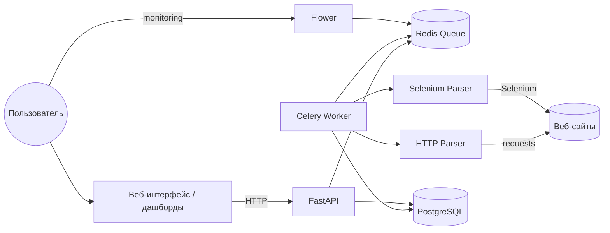

# Высшая школа парсинга

Система для сбора, хранения и визуализации данных с различных веб-ресурсов.

## Возможности

- **Парсинг статических сайтов** — HTTP-запросы с retry-логикой
- **Парсинг динамических сайтов** — Selenium для сайтов с JavaScript
- **Асинхронная обработка** — очередь задач через Celery
- **Хранение данных** — PostgreSQL с SQLAlchemy
- **Мониторинг** — Flower для отслеживания задач
- **Визуализация** — Grafana дашборды
- **API** — FastAPI с dependency injection

## Структура проекта

```
higher-school-of-parsing/
├── src/
│   ├── api/              # REST API
│   │   ├── routes.py     # Эндпоинты
│   │   └── schemas.py    # Pydantic-схемы
│   ├── core/             # Конфигурация
│   │   ├── config.py     # Настройки (Pydantic Settings)
│   │   └── container.py  # Dependency Injection
│   ├── db/               # База данных
│   │   ├── models.py     # SQLAlchemy модели
│   │   ├── database.py   # Подключение к БД
│   │   ├── session.py    # Сессии
│   │   └── crud.py       # CRUD операции
│   ├── parsers/          # Модуль парсеров
│   │   ├── base.py       # Абстрактный класс
│   │   ├── http.py       # HTTP парсер (requests + tenacity)
│   │   ├── browser.py    # Selenium парсер
│   │   └── exceptions.py # Кастомные исключения
│   ├── repositories/     # Репозитории
│   │   └── task_repository.py
│   ├── services/         # Бизнес-логика
│   │   └── parser.py     # Сервис парсинга
│   ├── worker/           # Celery
│   │   ├── celery_app.py # Конфигурация Celery
│   │   └── tasks.py      # Celery задачи
│   └── main.py           # Точка входа FastAPI
├── tests/                # Тесты
│   ├── conftest.py
│   ├── test_parsers.py
│   ├── test_api.py
│   ├── test_repository.py
│   └── test_worker.py
├── grafana/              # Grafana дашборды
├── docker-compose.yml
├── Dockerfile
└── requirements.txt
```

## Технологический стек

| Компонент | Технология |
|-----------|-----------|
| **Backend** | FastAPI 0.104.1 |
| **База данных** | PostgreSQL 15 |
| **ORM** | SQLAlchemy 2.0.23 |
| **Очередь задач** | Celery 5.3.6 + Redis 5.0.1 |
| **Парсинг** | requests, BeautifulSoup4, Selenium 4.15.2, Tenacity |
| **Мониторинг** | Flower, Grafana |
| **DI Container** | dependency-injector |
| **Валидация** | Pydantic 2.5.2 |
| **Тестирование** | pytest 7.4.3, pytest-mock |
| **Типизация** | mypy 1.7.1 |

## Быстрый старт

### 1. Клонирование репозитория

```bash
git clone https://github.com/r20xd/higher-school-of-parsing.git
cd higher-school-of-parsing
```

### 2. Настройка окружения

Скопируйте `.env.example` в `.env` и настройте переменные:

```bash
cp .env.example .env
```

Пример `.env`:
```env
# Postgres
POSTGRES_USER=postgres
POSTGRES_PASSWORD=your_password
POSTGRES_DB=parsing_db

# Grafana
GF_SECURITY_ADMIN_PASSWORD=admin
```

### 3. Запуск через Docker

```bash
docker-compose up --build
```

Сервисы будут доступны на:
- **API**: http://localhost:8000
- **API Docs**: http://localhost:8000/docs
- **Flower**: http://localhost:5555
- **Grafana**: http://localhost:3000

## API

### Запуск задачи парсинга

```bash
POST /parse
Content-Type: application/json

{
  "url": "https://example.com",
  "method": "http"  # или "selenium"
}
```

**Ответ:**
```json
{
  "task_id": "550e8400-e29b-41d4-a716-446655440000"
}
```

### Получение статуса задачи

```bash
GET /tasks/{task_id}
```

**Ответ:**
```json
{
  "id": "550e8400-e29b-41d4-a716-446655440000",
  "status": "done",
  "result": {
    "url": "https://example.com",
    "title": "Example Domain",
    "success": true
  },
  "created_at": "2024-01-01T12:00:00"
}
```

## Тестирование

Запуск всех тестов:

```bash
pytest tests/ -v
```

Запуск с coverage:

```bash
pytest tests/ --cov=src --cov-report=html
```

## Архитектура



### Основные компоненты

1. **FastAPI** — REST API с Dependency Injection
2. **Celery Worker** — асинхронная обработка задач парсинга
3. **HTTP Parser** — парсинг статических сайтов с retry-логикой
4. **Selenium Parser** — парсинг динамических сайтов
5. **PostgreSQL** — хранение задач и результатов
6. **Flower** — мониторинг задач Celery
7. **Grafana** — визуализация статистики

## Особенности реализации

### Парсеры

**HTTP Parser** (`src/parsers/http.py`):
- Retry-логика через Tenacity
- Настраиваемый timeout
- Обработка HTTP-ошибок

**Selenium Parser** (`src/parsers/browser.py`):
- Remote WebDriver (контейнер selenium)
- Context manager для управления ресурсами
- Ожидание элементов с WebDriverWait

### Dependency Injection

Использование `dependency-injector` для управления зависимостями:

```python
from src.core.container import Container

container = Container()
task_repository = container.task_repository()
```

### Обработка ошибок

Кастомные исключения:
- `ParsingError` — ошибки парсинга (элемент не найден)
- `NetworkError` — сетевые ошибки (timeout, 5xx)

## Роли в команде

- **TL: Валиуллин Владимир** — архитектура, часть бэкенда (часть FastAPI + правки по всем блокам), тесты, координация, ревью.
- **Dev2: Елисеев Павел** — парсеры, логика сбора и обработки данных, тесты к парсерам.
- **Dev3: Василькова Марина** — настройка PostgreSQL, схема БД, часть FastAPI, дашборды.

## Лицензия

MIT
