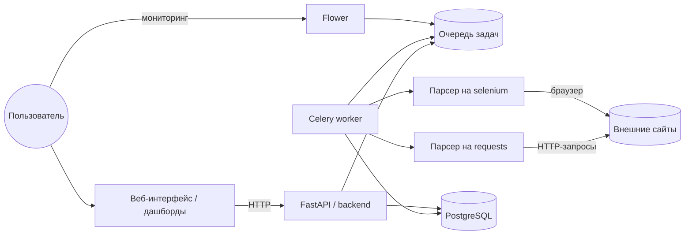

# Высшая школа парсинга
## Идея

Разработка системы для сбора, хранения и визуализации данных с разных веб-ресурсов.

Функциональность:

- Запуск задач парсинга через Celery.
- Использование разных методов парсинга(`requests`, `selenium`):
- Хранение данных в **PostgreSQL**.
- Построение дашбордов со статистикой и аналитикой.
- Мониторинг задач через **Flower**.
- Проект упакован в Docker и запускается через `docker-compose`.

## Что будет видеть пользователь

Взаимодействие с пользователем происходит через веб-интерфейс(дашборды):

**Главный дашборд:**
   - количество успешно выполненных задач за период;
   - число неуспешных задач;
   - объем собранных записей.
   - график с времем выполнения задач по источникам;
   - график с количеством собранных объектов по дням/неделям.
   - фильтры: по источнику, типу данных, диапазону дат и т.п.

**Дашборд по источникам:**
   - список источников: название, URL, тип парсера (`requests` / `selenium`), статус;
   - по каждому источнику: сколько записей, когда последний раз парсили, сколько было ошибок.

**Страница задач парсинга:**
   - список последних задач: источник, время запуска, статус, длительность;
   - кнопка «запустить парсинг»;
   - отдельная ссылка на Flower для подробного мониторинга.

**(Опционально) Страница детального просмотра данных:**
   - таблица с собранными данными.
   - возможность выгрузки в CSV.

## Архитектура системы

### Компоненты системы

- **FastAPI**.
- **Парсеры**:
  - модуль с `requests`-парсером;
  - модуль с `selenium`-парсером.
- **Celery**:
  - воркеры, которые запускают парсеры;
  - очередь задач;
  - Flower для мониторинга.
- **PostgreSQL** — хранение данных и статистики.
- **Дашборды** — Grafana / Dash / фронтенд на JS.
- **Docker / docker-compose** — запуск всех сервисов.

### Схема взаимодействия компонентов системы

## Распределение времени на выполнение задач проекта

- Настроить структуру проекта и базовый FastAPI — 3 дня.
- Настроить PostgreSQL и модели данных — 4 дня.
- Настроить Celery, брокер и Flower — 3 дня.
- Реализовать парсеры (`requests` и `selenium`) — ~5 дней.
- Сделать дашборды (Grafana / Dash / JS) — 4 дня.
- Написать тесты — 2 дня.

## Роли в команде

- **TL: Валиуллин Владимир** — архитектура, часть бэкенда, инфра, тесты, координация, ревью.
- **Dev2: Елисеев Павел** — парсеры, логика сбора и обработки данных.
- **Dev3: Василькова Марина** — настройка PostgreSQL, схема БД, FastAPI, дашборды.
